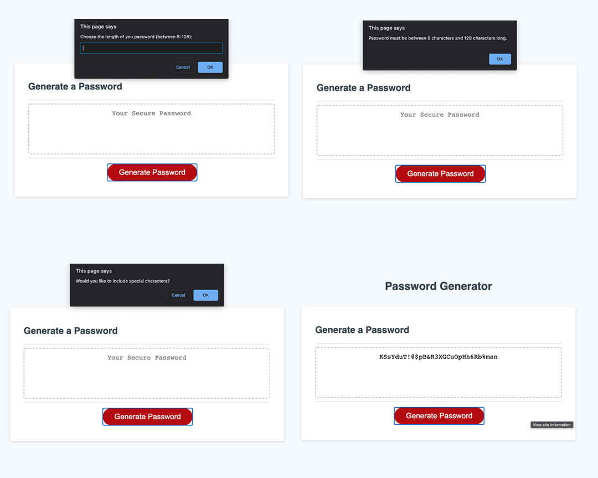

# 003-JS-password-generator

## Project Goal

The goal of this project was to use Javascript to generate a random password using prompts and  the following criteria:

The length must be between 8-128 charachters and must include at least one of the following criteria:
 - lowercase letters
 - uppercase letters
 - numbers
 - specialcharacters

 ## Logic

 I worked on individual pieces on their own first, and then combined everything into a single function.

 I started by creating 1 variable for the length and 4 different variables each for lowercase, uppercase, numbers and special characters. I also included an empty "requirements" variable where each of the original 4 variables could be combined.

 I then began by working out the logic of randomizing each individual index of a string. Using a for loop, I iterated with Math.floor(Math.random()) over a predetermined string. This result was saved to a variable named randGenerate. Using this iteration, I then saved each randomized number to a variable that includes the predetermined string with the random generated number inside.
 
 Once I figured out how to randomizing each individual string item, I then proceeded to figure out the logic for the password requirements. Using do...while loops and if statements, I was able to validate the prompts to meet the requirements via booleans, and combine the necessary strings to a new variable named requirements. This variable will indicate which options the user has chosen to include in their password.

 I then applied the length and the requirements chosen to the initial for loop I created to randomize a string. Now, however, the user length and the requirements are being determined via the prompts the user chose. The final result was then logged and returned to the text area on the screen.

